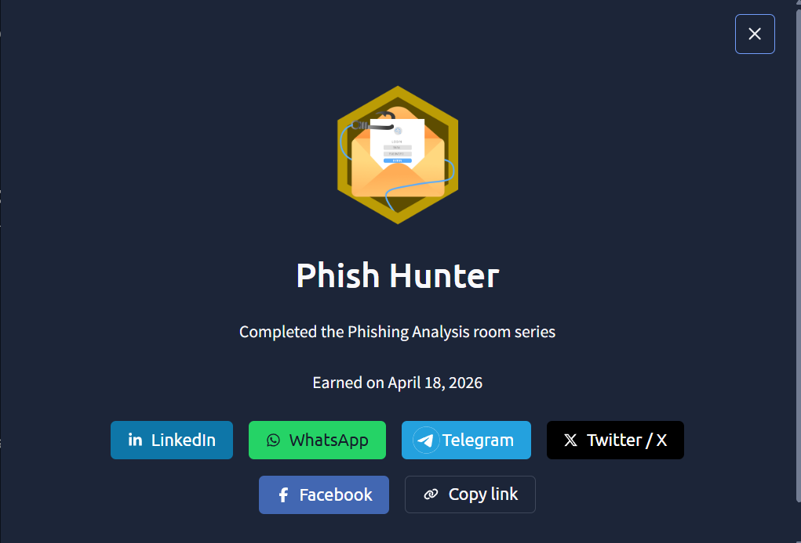

# Phish Hunter — TryHackMe writeup

**What I completed:** The full Phishing Analysis room series on TryHackMe, including:
- Email header analysis fundamentals (SPF, DKIM, DMARC authentication)
- Identifying live phishing indicators in URLs, sender patterns, and attachment behavior
- Hands-on analysis tooling (VirusTotal, urlscan.io, AbuseIPDB for URL/domain reputation)
- Two real-world simulations: "The Greenholt Phish" and "Snapped Phish-ing Line" — investigating malicious emails and tracing phishing campaigns from initial indicators through full campaign exposure

**Key concepts learned:**

The module reinforced that phishing investigations live on a spectrum — from obvious red flags (mismatched sender domains, suspicious URLs) to subtle social engineering (impersonating trusted internal addresses with lookalike domains). What stuck most was how a single suspicious URL click creates a chain of evidence: the sender's reputation, the destination site's age/registration, the redirection chain, and downstream account compromise attempts. The sandbox detonation labs showed why automated tools matter — they reveal payload behavior you'd never see from static analysis alone.

**How this applies to my SOC work:**

At EY, I handle 30-50 phishing alerts per shift across multiple client environments, and this lab directly mirrors that workflow. The email header analysis skills map directly to my daily use of Proofpoint email-layer triage and Sentinel/Defender correlation. What's changed from this lab is my perspective: I now explicitly look for the *campaign pattern* behind individual clicks — if one user clicked a malicious link, are there others from the same sender domain in the same time window? That's how you catch BEC and broader phishing campaigns, not just isolated incidents. The sandboxing concept also changed how I approach file attachments: beyond "is this executable flagged," I now think about behavioral indicators like registry modifications or network beaconing that only show up in detonation.

**Badge earned:** Phish Hunter badge on TryHackMe (May 2026)

