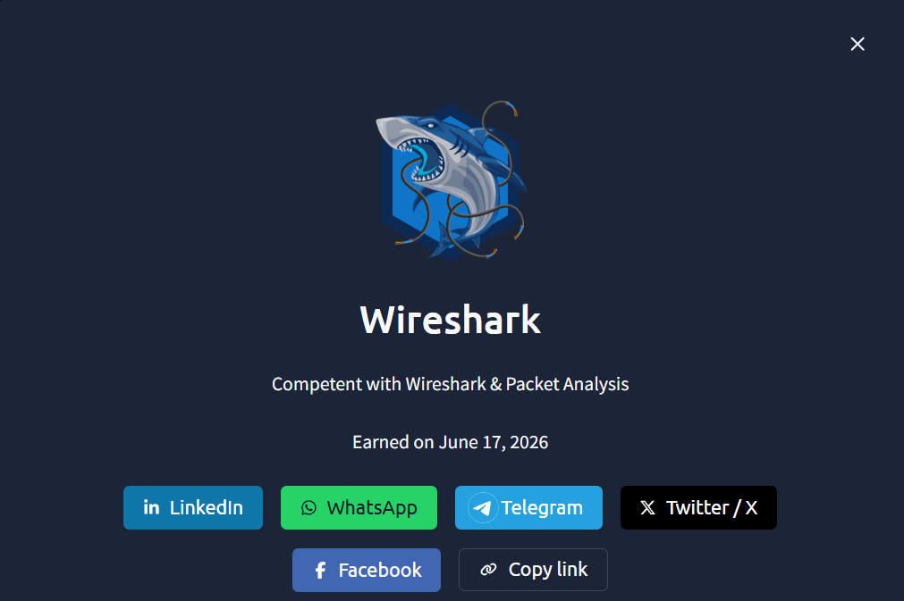

# Wireshark — TryHackMe writeup

**What I completed:** The Wireshark module series on TryHackMe, covering:
- The Basics: traffic sniffing, packet capture fundamentals, interpreting the packet view
- Packet Operations: dissection (breaking down OSI layers), navigation through packet streams, filtering for specific traffic patterns
- Traffic Analysis: identifying anomalies (unusual protocols, beaconing patterns, data exfiltration indicators), building IOC lists from raw traffic

**Key concepts learned:**

The hardest part was building intuition for what "normal" traffic actually looks like — once you see hundreds of DNS queries to legitimate resolvers, you start spotting the outlier queries to suspicious IPs. What surprised me most was how much context gets lost between the wire and a SIEM alert: Sentinel shows you "suspicious process execution," but the actual network traffic tells the full story of *how* that process communicated, *where* it sent data, and *whether* it was beaconing (repeated callbacks indicating persistence). The filtering labs were genuinely eye-opening — `tcp.flags.syn==1 and tcp.flags.ack==0` to find just the connection initiations, or filtering by source/destination IP pairs to isolate one suspect conversation out of thousands of flows. Packet capture is the ground truth layer.

**How this applies to my SOC work:**

In the SOC, most of my investigation happens at the alert layer (Sentinel/Defender), which is fast but abstracted. This lab taught me when to ask "what does the actual packet capture show?" — particularly for incidents where the automated detection might be noisy or when I need to prove lateral movement to a skeptical client. For example, impossible travel detections can be geolocation false positives, but if I can pull the packet capture and see the TCP handshake timestamps from two continents within seconds of each other, that's undisputable proof. The TTL (time-to-live) analysis from the Wireshark labs also changed how I read endpoint telemetry — unusual TTL values can indicate proxy/VPN use or malware routing traffic through compromised systems. I haven't used Wireshark in my daily EY SOC work yet (we rely on Sentinel's network integration), but this module equipped me to be dangerous if a client needs deep packet analysis for incident reconstruction or forensics.

**Badge earned:** Wireshark badge on TryHackMe (June 2026)

